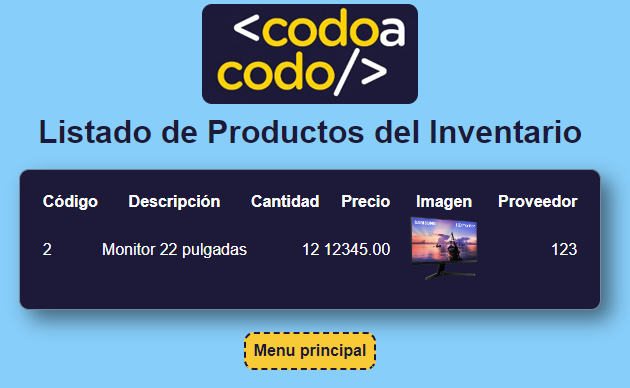
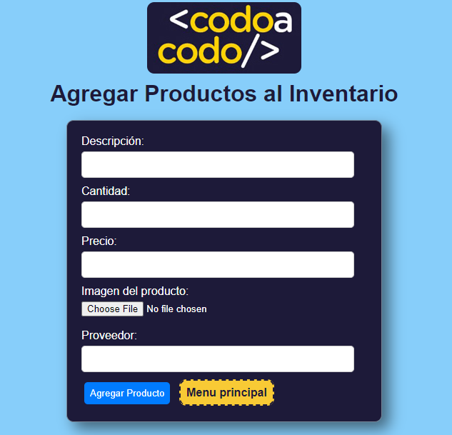
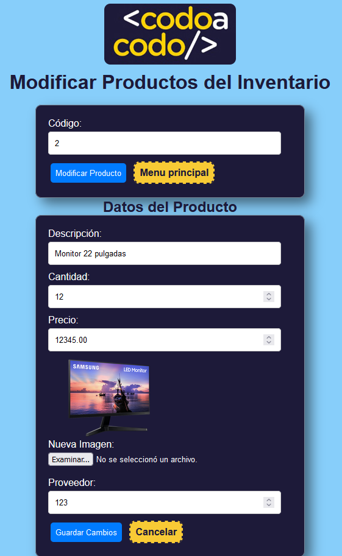

# Proyecto de BackEnd para el programa Codo a Codo


---

**Tabla de contenido**

- [Proyecto de BackEnd para el programa Codo a Codo](#proyecto-de-backend-para-el-programa-codo-a-codo)
  - [Descripción general](#descripción-general)
  - [Clonando el repositorio](#clonando-el-repositorio)
  - [Configuración](#configuración)
  - [Funcionamiento](#funcionamiento)
    - [BackEnd](#backend)
      - [API](#api)
        - [Base URL](#base-url)
        - [Endpoints](#endpoints)
          - [`GET` `/productos` `(Lista todos los productos cargados y sus propiedades)`](#get-productos-lista-todos-los-productos-cargados-y-sus-propiedades)
          - [`GET` `/productos/<int:codigo>` `(Muestra las propiedades del producto seleccionado)`](#get-productosintcodigo-muestra-las-propiedades-del-producto-seleccionado)
          - [`POST` `/productos` `(Agrega un producto a la lista)`](#post-productos-agrega-un-producto-a-la-lista)
          - [`PUT` `/productos/<int:codigo>` `(Modifica el producto seleccionado)`](#put-productosintcodigo-modifica-el-producto-seleccionado)
          - [`DELETE` `/productos/<int:codigo>` `(Elimina el producto seleccionado)`](#delete-productosintcodigo-elimina-el-producto-seleccionado)
      - [Cerrando conexiones a la Base de datos](#cerrando-conexiones-a-la-base-de-datos)
      - [Usando API Key de PythonAnywhere para recargar el sitio](#usando-api-key-de-pythonanywhere-para-recargar-el-sitio)
          - [`POST` `/api/v0/user/{tu_usuario}/webapps/{tu_dominio}/reload/` `(Recarga la pagina web.)`](#post-apiv0usertu_usuariowebappstu_dominioreload-recarga-la-pagina-web)
    - [FrontEnd](#frontend)
      - [index.html](#indexhtml)
      - [listado.html](#listadohtml)
      - [altas.html](#altashtml)
      - [modificaciones.html](#modificacioneshtml)
      - [listadoEliminar.html](#listadoeliminarhtml)


## Descripción general

El proyecto se trata de un sistema que permite administrar una base de datos de productos, implementado una API en Python utilizando el framework Flask. Las operaciones que se realizarán en este proyecto es dar de alta, modificar, eliminar y listar los productos, operaciones que podrán hacer los usuarios a través de una página Web.

Como ejemplo trabajaremos con una empresa de venta de artículos de computación que ofrece sus productos a través de una Web.

Aquí hay un resumen de las principales características y funcionalidades del proyecto:

**Gestión de productos:**
- Agregar un nuevo producto al catálogo.
- Mostrar un listado de los productos en el catálogo.
- Modificar la información de un producto existente en el catálogo.
- Eliminar un producto del catálogo.

**Persistencia de datos:**
- Los datos de los productos se almacenan en una base de datos SQL.
- Se utiliza una conexión a la base de datos para realizar operaciones CRUD en los productos.
- El código proporcionado incluye las clases Catálogo, que representa la estructura y funcionalidad relacionada con el catálogo de productos. Además, se define una serie de rutas en Flask para manejar las solicitudes HTTP relacionadas con la gestión de productos.

Se implementan desde cero el backend y el frontend. En el caso del backend, el proyecto va "evolucionando", comenzando en el desarrollo de las funciones que se necesitan para manipular los productos utilizando arreglos en memoria, luego se modifica para utilizar objetos, más tarde se gestiona la persistencia de los datos utilizando una base de datos SQL, se aloja el script Python en un servidor, y por último se crea un frontend básico para interactuar con los datos desde el navegador, a través de la API creada. Para este primer proyecto de BackEnd no vamos a utilizar entornos virtuales de ningun tipo ya que el proposito es solo entender los conceptos.


El proyecto se divide en seis etapas:

1) Desarrollo de arreglos y funciones: Implementar un CRUD de productos utilizando arreglos y funciones.
2) Conversión a clases y objetos: Convertir las funciones vistas en objetos y clases.
3) Creación de la base de datos SQL: Utilizar como almacenamiento una base de datos SQL.
4) Implementación de la API en Flask: A través de este framework implementar una API que permita ser consumida desde el front.
5) Codificación del Front-End: Vistas que permitan realizar las operaciones del CRUD.
6) Despliegue en servidor PythonAnywhere: Hosting para aplicaciones web escritas en Python.

## Clonando el repositorio

Para clonar este repo localmente, ejecuta en la terminal el siguiente comando.

```properties
git clone https://github.com/maxisimonazzi/proyecto-fullstack-codo2024-1ercuatrimestre.git
```

Si queres replicar este repo en tu cuenta de github podes hacer un fork al proyecto o sino crear un nuevo repo en tu perfil y luego agregar los archivos de tu repo local.

```properties
#En tu repo local
git init
git add .
git commit -m "primer commit"
git branch -M main
git remote add origin https://github.com/{tu_usuario}/tu_repo.git
git push -u origin main
```

## Configuración

La app hace uso del archivo datosconexion.py para obtener las variables de conexion a la base de datos y la API de PythonAnywhere. En el repo vas a encontrar el archivo **`datosconexion-template.py`** que tiene la siguiente estructura

```Python
# Datos de acceso a la Base de Datos
host='host'
user='user'
password='pass'
database='database'

# Credenciales API PythonAnywhere
username = "xxxxxxx"
api_token = "api_token"
domain_name = "xxxxxxx.pythonanywhere.com"
```

Reemplazar los datos para conectar con la base de datos segun corresponda, de igual manera los datos de la API Key (si se utiliza) y renombrar el archivo a **`datosconexion.py`** para que pueda ser importado correctamente por la app.

Para obtener los datos de acceso a la Base de datos en PythonAnywhere nos dirigimos a la seccion Database


Para obtener la API Key en PythonAnywhere 


## Funcionamiento

Explicaremos el funcionamiento dividido en dos partes, el FrontEnd y el BackEnd.

### BackEnd

El archivo **`app.py`** contiene todo el backend sin modularizar. Lo primero que hay que hacer es especificar la ruta correcta donde seran guardadas las imagenes

```properties
ruta_destino = './static/imagenes/'
```

Esta debe ser cambiada por la ruta a utilizar en PythonAnywhere, que sera del tipo:

```properties
ruta_destino = '/home/{tu_usuario}/mysite/static/imagenes/'
```

Una vez realizado este cambio, podemos ver los metodos de la clase Catalogo como asi tambien los endpoints definidos en Flask.

#### API

##### Base URL

La URL base para tu API sera la que te entregue PythonAnywhere y dependera de tu nombre de usuario:

```properties
https://{tu_usuario}.pythonanywhere.com/
```

##### Endpoints

<details>
<summary>
  
###### `GET` `/productos` `(Lista todos los productos cargados y sus propiedades)`
</summary>

###### Parametros

> Ninguno

###### Respuesta

> | Código HTTP  | content-type | Respuesta |
> | :---------- | :----------: | :-------: |
> | 200  | application/json  | JSON  |

###### Ejemplo con cURL
```bash
curl -X GET -H "Content-Type: application/json" https://{tu_usuario}.pythonanywhere.com/productos
```
</details>

<details>
<summary>
  
###### `GET` `/productos/<int:codigo>` `(Muestra las propiedades del producto seleccionado)`
</summary>

###### Parametros

> Ninguno

###### Respuesta

> | Código HTTP  | content-type | Respuesta |
> | :---------- | :----------: | :-------: |
> | 200  | application/json  | JSON  |
> | 404  | application/json  | JSON  |

###### Ejemplo con cURL
```bash
curl -X GET -H "Content-Type: application/json" https://{tu_usuario}.pythonanywhere.com/productos/1
```
</details>

<details>
<summary>
  
###### `POST` `/productos` `(Agrega un producto a la lista)`
</summary>

###### Parametros

> | Nombre  | Tipo | Tipo de dato | Descripción |
> | :---------- | :----------: | :-------: | :------- |
> | descripcion  | requerido  | string  | Descripcion del producto |
> | cantidad  | requerido  | int  | Cantidad del producto a agregar |
> | precio  | requerido  | float  | Precio del producto a agregar |
> | proveedor  | requerido  | int  | Codigo del proveedor del producto a agregar |
> | imagen  | requerido  | file  | Imagen del producto a agregar |

###### Respuesta

> | Código HTTP  | content-type | Respuesta |
> | :----------: | :----------: | :-------: |
> | 201  | application/json  | JSON  |
> | 400  | text/html; charset=utf-8  | None  |
> | 500  | application/json  | JSON  |

###### Ejemplo con cURL
```bash
curl -X POST -H 'Content-Type: multipart/form-data' -F 'descripcion=Descripción del producto' -F 'cantidad=5' -F 'precio=10000' -F 'proveedor=123' -F imagen=@./static/imagenes/img.jpg https://{tu_usuario}.pythonanywhere.com/productos
```
</details>

<details>
<summary>
  
###### `PUT` `/productos/<int:codigo>` `(Modifica el producto seleccionado)`
</summary>

###### Parametros

> | Nombre  | Tipo | Tipo de dato | Descripción |
> | :---------- | :----------: | :-------: | :------- |
> | descripcion  | requerido  | string  | Descripcion del producto |
> | cantidad  | requerido  | int  | Cantidad del producto a agregar |
> | precio  | requerido  | float  | Precio del producto a agregar |
> | proveedor  | requerido  | int  | Codigo del proveedor del producto a agregar |
> | imagen  | requerido  | file  | Imagen del producto a agregar |

###### Respuesta

> | Código HTTP  | content-type | Respuesta |
> | :----------: | :----------: | :-------: |
> | 200  | application/json  | JSON  |
> | 404  | application/json  | JSON  |

###### Ejemplo con cURL
```bash
curl -X PUT -H 'Content-Type: multipart/form-data' -F 'descripcion=Descripción del producto' -F 'cantidad=5' -F 'precio=10000' -F 'proveedor=123' -F imagen=@./static/imagenes/img.jpg https://{tu_usuario}.pythonanywhere.com/productos
```
</details>

<details>
<summary>
  
###### `DELETE` `/productos/<int:codigo>` `(Elimina el producto seleccionado)`
</summary>

###### Parametros

> Ninguno

###### Respuesta

> | Código HTTP  | content-type | Respuesta |
> | :----------: | :----------: | :-------: |
> | 200  | application/json  | JSON  |
> | 404  | application/json  | JSON  |

###### Ejemplo con cURL
```bash
curl -X DELETE -H "Content-Type: application/json" https://{tu_usuario}.pythonanywhere.com/productos/1
```
</details>

#### Cerrando conexiones a la Base de datos

Por cuestionas meramente pedagogicas, en el archivo **`app.py`** se abre una conexion a la Base de datos para luego ejecutar todas las consultas necesarias. Esta conexion no se cierra nunca, y como es de esperarse, el motor de Base de datos cierra automaticamente la conexion luego de un tiempo de inactividad, por lo que la app devuelve un error cuando intenta consultar la base de datos.

Para sobrellevar esto, implementamos la alternativa de abrir una conexion antes de ejecutar cualquier consulta y cerrarla luego de terminarla, de esta manera, las conexiones son efimeras y solo se conectara cuando se necesite hacer una consulta. Esto lo tenemos resuelto dentro del archivo **`app_closingconnection.py`**.

Alli veremos que la clase Catalogo tiene dos metodos nuevos, uno llamado **`conectar`** y otro llamado **`desconectar`**. El primero abre una conexion a la Base de datos y el segundo cierra la conexion a la Base de datos. Al momento de ejecutar una consulta, primero llamamos al metodo de conectar y luego al metodo desconectar.

#### Usando API Key de PythonAnywhere para recargar el sitio

Muchas veces, la app alojada en PythonAnywhere deja de responder, ya sea por una limitacion de los recursos gratuitos o por que no se usa la implementacion de cerrar la conexion a la base de datos. En esas situaciones la pagina debe recargarse en PythonAnywhere haciendo click en el boton **`Reload`**. Esto implica tener que dirigirnos a la pagina, loguearnos y luego buscar el boton reload de forma manual, lo cual puede ser tedioso.

Para solucionar esto, podemos realizar este procedimiento haciendo uso de la API de PythonAnywhere y hacer la recarga directamente desde una peticion.

<details>
<summary>
  
###### `POST` `/api/v0/user/{tu_usuario}/webapps/{tu_dominio}/reload/` `(Recarga la pagina web.)` 
</summary>

###### Parametros

> Ninguno

###### Cabcera

> La cabecera a mandar debe ser 'Authorization: Token {tu_token}'

###### Respuesta

> | Código HTTP  | content-type | Respuesta |
> | :----------: | :----------: | :-------: |
> | 200  | application/json  | JSON  |

###### Ejemplo con cURL
```bash
curl -X POST -H 'Authorization: Token {tu_token}' https://www.pythonanywhere.com/api/v0/user/{tu_usuario}/webapps/{nomre_de_dominio}/reload/
```
</details>

La documentacion de la API la encuentran en el siguiente link https://help.pythonanywhere.com/pages/API/

### FrontEnd

Los archivos que componen el mini FrontEnd son 5.

```properties
- index.html
- listado.html
- altas.html
- modificaciones.html
- listadoEliminar.html
```

#### index.html

Esta página actúa como un menú o punto de entrada para distintas funciones de la aplicación web, cada una relacionada con el manejo de productos a través de una API. El uso de una tabla para organizar los enlaces proporciona una estructura clara y sencilla para la navegación.


#### listado.html

Esta página es la encargada de mostrar un listado de productos. Crea una tabla de productos con sus detalles, utilizando JavaScript para realizar una solicitud al servidor y recuperar los datos de los productos, que luego agrega dinámicamente en la tabla. El script maneja tanto la recuperación exitosa de los datos como los posibles errores que puedan surgir durante el proceso.



#### altas.html

Aqio podremos agregar productos al Catalogo. Incluye un formulario para introducir los detalles del producto y un script de JavaScript para manejar el envío de estos datos al servidor de manera asíncrona, sin recargar la página.



#### modificaciones.html

Esta página web le permite al usuario obtener los detalles de un producto específico, modificar esos detalles y enviar los cambios al servidor.



#### listadoEliminar.html

Esta página le permite al usuario obtener un listado de los productos, con la posibilidad de eliminarlos.


Estos archivos html pueden ser subidos a cualquier hosting/servidor gratuito. En clases vimos el ejemplo de subirlo a Netlify.

Es importante que antes de subir los archivos al servidor, modificar las rutas en los html para que las peticiones las haga a la URL de nuestro app en PythonAnywhere, para ello modificamos la constante **`URL`** de la siguiente manera

```properties
const URL = "https://{tu_usuario}.pythonanywhere.com/"
```

De igual manera hay que cambiar las secciones donde tiene que buscar las imagenes de los productos, que al ser enviadas mediante un formulario a la app, las mismas son guardadas en PythonAnywhere, por ello debemos colocar su ruta. Para ello, debemos buscar en los html la siguiente parte

```properties
src=./static/imagenes/
```

Y modificarla por la correspondiente

```properties
src=https://{tu_usuario}.pythonanywhere.com/static/imagenes/
```

**Observaciones:** Dentro de los html veran dos maneras distintas de armar las tablas con los productos. Para ello se utilizan dos formas distintas de manipulacion del DOM. En el listado.html vamos a ver como se modifica el cuerpo de la tabla directamente.

```js
document.getElementById('tablaProductos')
```

En cambio en el listadoeliminar.html veremos que modificamos la tabla apuntando al TagName.

```js
document.getElementById('productos-table').getElementsByTagName('tbody')[0];
```

En ambos caso, lo que hacemos es modificar el cuerpo de la tabla y el resultado es similar.